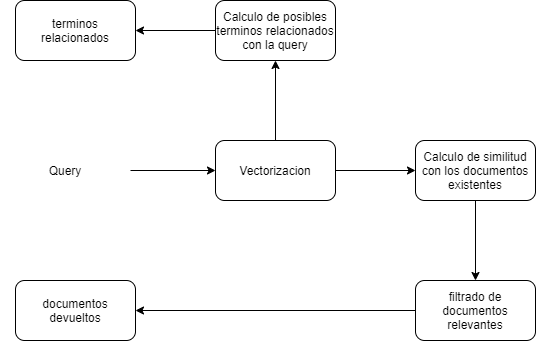

# SRIserver
Server to host search engine for Information Recovery project.

# Introduccion

"Informacion es poder", una frase autocontenida, que encierra las necesidades
siempre crecientes de nosotros como cientificos, y de nuestros usuarios como 
beneficiarios directos del producto que sale de nuestros programas. Esta necesidad
se vio grandemente reflejada en el ultimo proyecto "freelance" de nosotros (los autores),
cuando intentamos crear una herramienta que sirviera de ayuda a los heroes veraderos de estos
momentos, el personal medico. Sickipedia nace como un modulo que, desde hace algun tiempo, tenemos en mente incorporar al conjunto de funcionalidades de dicho proyecto, y hasta ahora
no era mas que una simple idea. El siguiente proyecto de SI, intenta servir de base para la implementacion de dicho modulo. Esta es la razon de que el conjunto de datos que elegimos sea
referente a la salud.

# Que se espera del sistema ?

En su integracion final, el sistema tiene que ser capaz de recibir una consulta (mas adelante
explicamos las estructuras de estas consultas y como las manejamos) propiciada por el usuario,
(que puede ser un personal medico o un paciente) y debe responder con un conjunto de enfermedades que mas se adecue a "lo que el usuario quiere recibir".

Esta descripcion es quizas un poco vaga, pero asi lo son generalemente los problemas
a los que nos enfrentamos. Podemos pensar que cualquier usuario, siempre va a querer
recibir enfermedades como resultado, pero lo mas importante es saber cuales les vamos a
propiciar.

# Estructura interna del sistema

Nuestro sistema debe manejar enfermedades, asi que hay que comenzar por representar dichas
enfermedades. 

## Enfermedades

Estas entidades conformaran los documentos de nuestro sistema, a cada una le asignaremos un ID,
por conveniencia sera un entero secuencial, de modo que el ID de un elemento permita acceder a 
este si decidimos almacenarlo en un array en memoria. Ademas cada enfermedad contara con una
descripcion, un nombre, un conjunto de sintomas y un tratamiento. Cada uno de estos campos sera
un string en ingles.

Estos campos permiten crear las enfermedades como objetos JSON y almacenarlas en un archivo
"diseases.json" o crear una representacion en una tabla y utilizar una base de datos relacional
para el almacenamiento (en la implementacion nos preocupamos por que fuera posible ambas opciones, por defecto se usa json como almacenamiento por comodidad, pero hacer un setup para
usar sqlite, posgresql o mysql no es dificil. Incluso se puede usar un schema de una bd no relacional como Mongo.)

El vocabulario de terminos que usara nuestro sistema estara compuesto por cada palabra que aparezca en cualquier campo de las efermedades, quitando algunas como preposiciones, conjunciones, articulos, comas, etc.

La representacion de las enfermedades nos da una idea inmediata de hacia donde esta dirigida nuestra implementacion. Evidentemente, esperamos que en la query hayan algunos terminos que pertenezcan
al vocabulario, lo que significa que aparecen en algun campo de las enfermedades, y por tanto hay
alguna enfermedad con algun nivel de similitud entre la query y algunos documentos. Es perfectamente
posible que en la query no aparezcan terminos del vocabulario, en este caso el sistema no deberia devolver ningun documento como relevante.

## Modelo

En un primer momento, el problema planteado puede llevar a pensar que el modelo boleano es el
indicado para resolverlo. Ciertamente, este modelo cumple la restriccion de que solo devuelva 
documentos que contengan algun termino de la query, pero rapidamente este modelo devuelve resultados
no deseados, ademas de que no es capaz de establecer una diferencia entre dos documentos devueltos, no
existe nocion de orden de relevancia. Por lo tanto pasamos al modelo vectorial. Este modelo resulta
adecuado para nuestro problema por el hecho de que necesitamos asignar un peso a cada termino en los
documentos, y que este peso este influido por la cantidad de veces que aparece este termino en el documento (esta idea responde a que un termino que aparezca en el nombre de una enfermedad, es menos
probable que aparezca mas repetido que un termino que aparezca en los sintomas, por lo que deberia
tener mayor impacto en la busqueda). Por supuesto, la habilidad de nuestros usuarios de conjurar
querys adecuadas puede influir positivamente en la precision de nuestro modelo, por lo que dedicamos
esfuerzos a indicar algunas ayudas para que el usuario genere mejore sus consultas a traves de 
funcionalidades como autocompletamiento y sugerencia de terminos relacionados que les permita extender
su consulta.

En general, el proceso de obtencion de los resultados en el sistema se ve asi:

## Procesamiento de la query
(TODO) ESTO ES TUYO ELI, aqui va todo lo del autocompletamiento, extension de la query, etc.
(OJO) SOlO la descripcion de como se hace, y porque, aqui no va nada de implementacion ni codigo ni nada.

## Vectorizacion

La vectorizacion comprende el proceso de convertir la query y cada
documento de la coleccion en un vector. Para la query, calculamos la maxima frequencia
de los terminos del vocabulario en la propia query, y luego generamos un vector con N componentes (donde N
es la cantidad de terminos en el vocabulario) donde cada componente i se calcula de la siguiente forma:

En este punto, es necesario aclarar una modificacion que le hacemos al modelo. Es posible que
la maxima frequencia sea 0, en caso de que ningun termino de la query aparezca en el vocabulario. En este caso decidimos devolver el vector (0, 0, ..., 0), lo que provoca que todo documento tenga similitud 0 con esta query, y por tanto no se devuelva ningun documento.
Este comportamiento es consistente con el hecho de que un documento es relevante si al menos
un termino de la query esta en el, y ademas, se logra que terminos aleatorios no tengan ningun peso en la busqueda.

Para los documentos, se sigue una idea parecida, se calculan las frequencias de cada termino
del documento y la frecuenia de ocurrencia del termino, lo que se conoce como "algoritmo
tf-idf". En la implementacion pudieramos haber utilizado un modulo experimental de keras
que aplica este algoritmo automaticamente, pero queda mucho mejor hecho a mano (y se aprende mas :).

## Calculo de similitud

Una vez formado los vectores de consulta y los de los documentos, formamos un nuevo vector, con
una componente por cada documento que representa la similitud de este documento con la consulta.

El calculo de este vector es donde las cosas se ponen interesantes. El sistema ofrece dos modos
de busqueda, raw y enhanced. En el metodo de busqueda raw, calculamos la similitud de cada documento con la consulta utilizando la funcion coseno, tenemos en cuenta que esta similitud
puede ser 0, y luego filtramos los documentos de relevancia 0 y ordenamos la lista de documentos
similares para devolverla. Este enfoque tiene varias ventajas:

  * Solo se devuelven documentos con algun termino de la query

  * El coseno funciona bien ordenando documentos por la "relevancia" de sus terminos

  * Es facil de implementar

Pero el problema es que lo que el coseno interpreta por relevante, puede no ser relevante para
un especialista de la salud. Por ejemplo, si buscamos "cough", el coseno bien pudiera devolvernos
como mas relevante "cold", que "covid", sin embargo con las situaciones actuales, es mucho mas probable que una persona con tos tenga covid, o que alguien que busca tos como descripcion o nombre, este mas interesado en la covid que en el resfriado comun. Este tipo de "inferencia", el 
sistema no puede hacerlo por si solo utilizando solamente la funcion coseno. Para ello incorporamos un mecanismo de retroalimentacion.

La retroalimentacion no ocurre de la forma descrita en las conferencias, no nos gusta la idea
de un usuario eligiendo que documentos son mas relevantes que otros, mas que nada porque es 
posible que la eleccion de un usuario no sea una fiel representacion de la relevancia de un
termino para una enfermedad, pues el sistema esta orientado tanto a pacientes como a especialistas.

Dicho esto, necesitamos nutrirnos de algun lugar. La idea es que existan repositorios de 
clasificaciones realizadas solo por especialistas, a estos repositorios accederia nuestro sistema
con un crawler, para obtener la retroalimentacion necesaria para mejorar las consultas.

En el proyecto actual, por restricciones de conectividad y la dificultad de generar estos repositorios (solo contamos con un personal de salud que nos ayudara para el proyecto), simulamos
los mismos con un generador datos de entrenamiento aleatorio. Este generador no es tan simple
como suena, no es poner valores aleatorios en las consultas y valores aleatorios a los documentos.
Lo que hacemos es obtener el vocabulario de nuestro sistema, de ahi generamos consultas aleatorias 
que contengan terminos del vocabulario y/o terminos aleatorios (giberish), de modo que se generen
consultas completamente irrelevantes, y otras que solo tengan terminos del vocabulario y otras mixtas.
Luego que tenemos estas consultas, se las pasamos a nuestro sistema vectorial basado en coseno (raw search) y obtenemos los documentos que son relevantes, luego tomamos cada valor de similaridad y
aleatoriamente lo hacemos 0 o le asignamos un valor aleatorio entre 0 y 1. Este proceso puede ser visto
como un usuario haciendo preguntas aleatorias al sistema y seleccionando aleatoriamente documentos como relevantes o no. Aunque este proceso disminuye la "realidad" de nuestros resultados, nos permite
evaluar de manera efectiva nuestro modelo frente a la retroalimentacion.

Solo nos queda integrar este mecanismo con el sistema. Para eso esta el modulo enhanced search.
En este modo, el sistema realiza los mismos pasos que el modo raw, hasta obtener el vector de similaridad a traves del coseno. Una vez que este vector es obtenido, se le pasa a una red neuronal
(la estructura la describimos mas adelante) que produce un vector final con el vector real de similaridad para los documentos.
Esta red se entrena con los datos obtenidos de la retroalimentacion, y se compila a archivos que luego son cargados por el servidor. De esta forma el sistema lanza cada cierto tiempo background tasks que actualizan los repositorios de clasificaciones, luego reentrenan el modelo con esta nueva informacion, lo compila (serializa) y luego el sistema lo carga para realizar el filtrado de relevancia.

## Estructura de la red neuronal del modo enhanced.

La figura muestra la estructura de nuestra red, una capa de entrada con n + m nodos (n es la cantidad de documentos del sistema y m es la cantidad de terminos del vocabulario), una capa interna de m nodos y la capa de salida de n nodos. Los primeros n nodos de la capa de entrada
se conectan con todos los nodos interiores; los restantes m nodos se conectan uno a uno, el nodo n + i de la capa de entrada, con el nodo i de la capa interna. Cada nodo de la capa interna se
conecta con todos los nodos de la capa de salida.

Al modelo se le entra el vector similaridad calculado, y el vector consulta, y el sistema intenta
"reordenar" correctamente los valores de similitud del vector similaridad. La idea es que cada documento se conecta con cada termino, y cada componente de la query se conecta solo con el
termino al cual afecta su peso.

Este enfoque ofrece varias ventajas sobre el modo raw:

 * Todas las metricas mejoran

 * Tiene en cuenta las preferencias de los especialistas

 * Incorpora retroalimentacion continua al modelo.

 * Infiere resultados relevantes aun cuando los terminos de busqueda no aparezcan en el documento, por ejemplo, "death" se puede relacionar con "cancer", aun cuando esa palabra no
 aparezca directamente en los terminos de la enfermedad, solo 

El problema con este enfoque es que complejiza el proceso del calculo de los documentos relevantes, ya que hay que desarrollar la red, entrenarla, actualizar los repositorios, volver a 
entrenarla, etc. Ademas, la naturaleza de la red neural no permite conocer los criterios
utilizados para la clasificacion, por lo que funcionan algo asi como una caja negra. A pesar
de esto, esta funcionalidad provo ser una componente esencial para mejorar el funcionamiento 
de nuestro sistema.

## Obtencion de terminos relacionados

Uno de los mecanismos para mejorar los resultados ofrecidos por el sistema, es la expansion de
consultas, para la cual es necesario obtener un conjunto de terminos relacionados con la misma.
Esta fase es independiente del modo de busqueda y la idea es devolver un cojunto de terminos del
vocabulario que se puedan agregar a la consulta y permita obtener documentos mas relevantes, o 
aumentar la precision de los documentos devueltos. Para esto, en la fase de indexado, creamos 
una matriz de matcheo, que relaciona dos terminos si estos aparecen en el mismo documento, luego,
cuando una query es requerida, se buscan los terminos que matcheen con la mayor cantidad de 
terminos de la query. Estos terminos conforman una lista de posibles sugerencias, de las cuales
seleccionamos a lo sumo 4 terminos para enviar de vuelta al cliente como sugerencia para extender
su consulta.